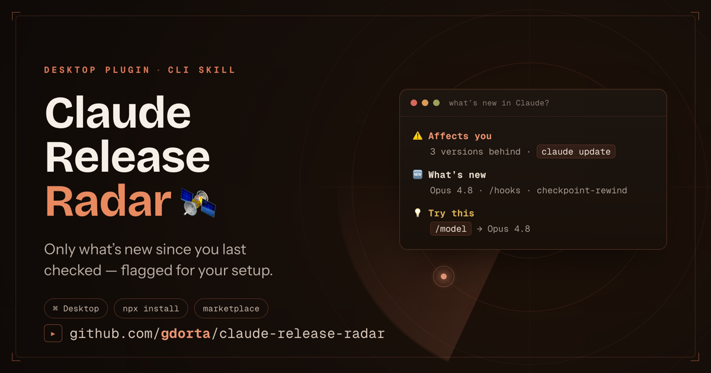
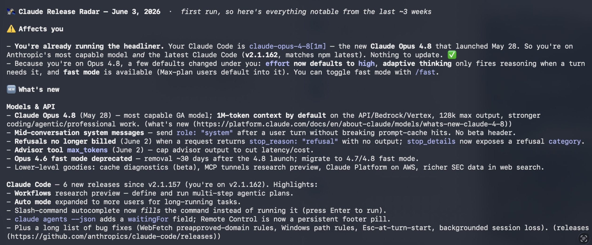

# 🛰️ Claude Release Radar

> Personalized "what's new in Claude" — only what changed since you last checked, only what matters for *your* setup.

[](https://www.npmjs.com/package/claude-release-radar)
[](https://github.com/gdorta/claude-release-radar/actions/workflows/test.yml)
[](LICENSE)
[](#)



Anthropic ships fast: new models, API changes, near-weekly Claude Code releases. Staying current means checking five pages and remembering what you already saw. This skill collapses that into one ask — **"what's new in Claude?"** — and answers with a briefing that shows only what's new since you last checked, flags the releases that actually affect your environment, and gives you the exact command to try them.

Here's a real briefing — your version gap up top, then what's new grouped by surface, then exactly what to try:



## Install

### 🖥️ Claude Desktop

[](claude://claude.ai/new?q=%2Fplugin%20marketplace%20add%20gdorta%2Fclaude-release-radar)

Click the button. Claude opens with the install command queued — hit Enter, then run `/plugin install claude-release-radar`. You're on auto-updates from then on.

<sub>macOS and Windows. Requires Claude Desktop. If nothing happens when you click, use drag-and-drop ↓</sub>

<details>
<summary>Drag-and-drop install (Linux, or no <code>claude://</code> handler)</summary>

1. Download [`claude-release-radar.plugin`](https://github.com/gdorta/claude-release-radar/releases/latest).
2. Drag it into a Claude chat — don't double-click it.
3. Click **Install**.

</details>

### ⌨️ Claude Code (terminal)

```bash
npx claude-release-radar install
```

### 🛠 Manual

```bash
git clone https://github.com/gdorta/claude-release-radar.git \
  ~/.claude/skills/claude-release-radar
```

### Standalone (no Claude needed)

The Python engine runs on its own:

```bash
python3 scripts/radar.py check          # render the briefing
python3 scripts/radar.py check --commit # render AND mark seen
```

After any install, ask Claude **"what's new in Claude?"** — the skill triggers automatically.

## Why it works

Most changelog tools are dumb feed readers. This one is **stateful** and **personalized**:

- **Only what's new.** Diffs every run against `state.json`. A trustworthy radar is quiet when the sky is clear.
- **Tailored to you.** Inspects your installed CLI version, skills, plugins, and MCP servers (read-only, names only) and flags the releases that touch *your* setup.
- **Action, not just news.** Every item comes with the exact command to try the new thing.
- **Multi-surface.** Tracks Claude Code (npm + GitHub releases + CHANGELOG), Models & API, and the Claude apps — in one call.
- **Zero dependencies.** Pure Python stdlib + Markdown.

## How it works

```
┌─────────────── sources.json ───────────────┐
│ npm version · GitHub releases · CHANGELOG  │  ← parsed deterministically
│ API notes · Anthropic news · app updates   │  ← summarized by the skill
└────────────────────────────────────────────┘
                      │
            scripts/radar.py
                      │
fetch ─► diff vs state.json ─► detect your env ─► personalize ─► briefing
```

Structured feeds (npm, Atom/RSS, Markdown changelog) are parsed deterministically by the engine. Narrative pages (model launches, API notes, app updates) have no clean feed, so the engine hands them to Claude to fetch and summarize — only entries newer than your last check. State lives at `~/.claude/claude-release-radar/state.json`.

## Commands

```bash
python3 scripts/radar.py check          # aggregate + diff + personalize + render
python3 scripts/radar.py check --json   # same, as a machine-readable object
python3 scripts/radar.py env            # show what it detected about your setup
python3 scripts/radar.py sources        # list configured sources
python3 scripts/radar.py mark-seen      # commit current items as a baseline
```

No network? Fetch the feeds yourself and point the engine at them:

```bash
python3 scripts/radar.py check --input ./fetched/
```

## Recurring digest

Get updates pushed to you instead of asking. The skill can set up a daily or weekly scheduled task in the Claude desktop app, or you can wire up cron / a GitHub Action that posts to Slack or email. Ready-to-paste recipes in [`reference/scheduling.md`](reference/scheduling.md).

## Customize what you track

Edit [`scripts/sources.json`](scripts/sources.json) — toggle `enabled`, or add your own feed (`npm` · `atom`/`rss` · `markdown-changelog` · `agent`). Two extras ship disabled: the docs "Claude Code release notes" page and the **ClaudeLog** YouTube channel. Full guide: [`reference/sources.md`](reference/sources.md).

## Privacy

Environment detection is **read-only** and records **names only** — your skills, plugins, and MCP server names. It never reads MCP credentials or any secret values. State stores seen-item ids, a timestamp, and the last CLI version. Nothing leaves your machine unless *you* wire up a Slack/email step.

## Project layout

```
claude-release-radar/
├── .claude-plugin/
│   ├── plugin.json              # Claude Desktop manifest
│   └── marketplace.json         # so /plugin marketplace add works
├── SKILL.md                     # how Claude uses the skill (canonical)
├── scripts/
│   ├── radar.py                 # the engine — stdlib only
│   └── sources.json             # the source registry
├── reference/
│   ├── sources.md               # every source + how to add your own
│   └── scheduling.md            # cron / GitHub Action / scheduled-task recipes
├── skills/claude-release-radar/ # auto-synced mirror for the Desktop plugin
├── tools/
│   ├── sync-skill.sh            # refresh the mirror from canonical files
│   └── build-plugin.sh          # zip the .plugin
├── bin/cli.js                   # `npx claude-release-radar install`
└── examples/sample_briefing.md  # example output
```

Root files (`SKILL.md`, `scripts/`, `reference/`) are **canonical**. `skills/claude-release-radar/` is an auto-generated mirror — never edit it directly; run `npm run sync` (or `bash tools/sync-skill.sh`) after touching a canonical file. CI fails any PR where the two drift.

## Credits

Inspired by the [**ClaudeLog** YouTube channel](https://www.youtube.com/@claudelog) — *"every Claude Code update, explained in under 3 minutes."* This project automates the "never miss an update" part and adds the personalization layer.

A community project. Not affiliated with or endorsed by Anthropic. "Claude" is a trademark of Anthropic; this tool reads Anthropic's public release sources.

## License

[MIT](LICENSE). PRs welcome — especially new sources and parsers.

---

*Built this because I kept finding out about Claude features weeks late. If it saves you the same, ⭐ the repo.*

— Gabe
